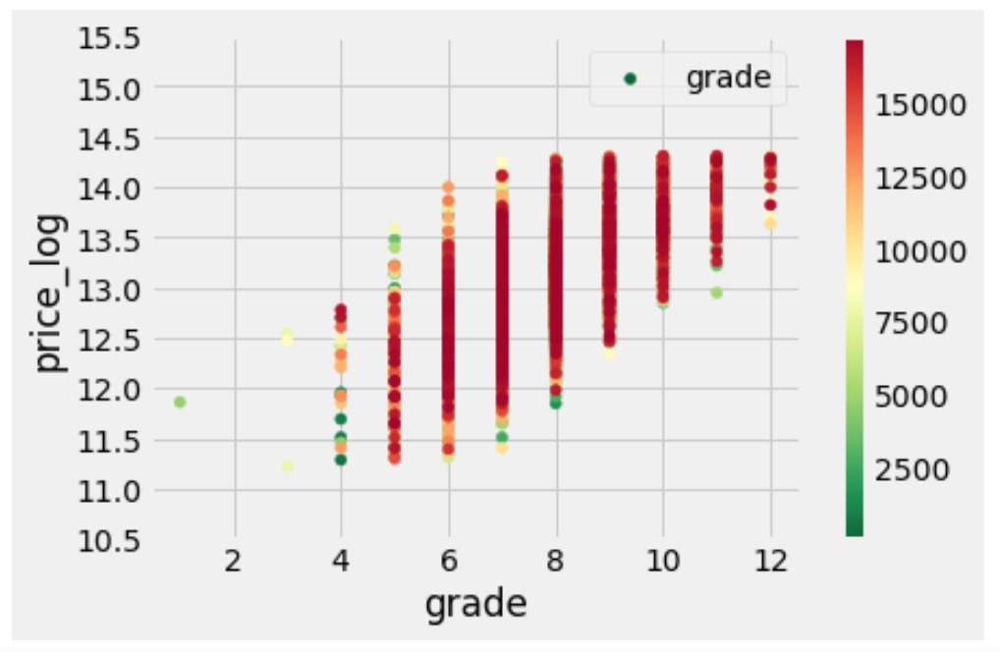

# Project Description
This Project aims to apply the data science concepts and machine learning methods to practice. We are trying to solve problems and gain insights in real-world settings.

This home dataset contains house sale prices for King County, which includes Seattle. It includes homes sold between May 2014 and May 2015. The dataset consists of following variables
### 1. DataSet 
We have two datasets: 
1. training dataset, which provides house price for each home ID and home sale date
2. test dataset, which provides all basic information about the house condiction without price. 
Our goal is to predict the sales price for each house in the test set based on the given features. 

### 2. Accuracy Metric 
RMSE between the logarithm of the predicted value and the logarithm of the observed sales price will be used to evaluate the prediction accuracy. (Taking logs means that errors in predicting expensive houses and cheap houses will affect the result equally.)

### 3. Variables Defination

* id - Unique ID for each home sold
* date - Date of the home sale 
* price - Price of each home sold 
* bedrooms - Number of bedrooms 
* bathrooms - Number of bathrooms, where .5 accounts for a room with a toilet but no shower 
* sqft_living - Square footage of the apartments interior living space 
* sqft_lot - Square footage of the land space 
* floors - Number of floors
* waterfront - A dummy variable for whether the apartment was overlooking the waterfront or not 
* view - An index from 0 to 4 of how good the view of the property was 
* condition - An index from 1 to 5 on the condition of the apartment
* grade - An index from 1 to 13, where 1-3 falls short of building construction and design, 7 has an average level of construction and design, and 11-13 * * have a high quality level of construction and design. 
* sqft_above - The square footage of the interior housing space that is above ground level 
* sqft_basement - The square footage of the interior housing space that is below ground level
* yr_built - The year the house was initially built
* yr_renovated - The year of the house’s last renovation 
* zipcode - What zipcode area the house is in 
* lat - Lattitude 
* long - Longitude 
* sqft_living15 - The square footage of interior housing living space for the nearest 15 neighbors 
* sqft_lot15 - The square footage of the land lots of the nearest 15 neighbors 

### 4. Mothods summary
#### 1) Feature Engineering
By creating distribution plot for each variable and check the distribution of values, we found that some data cleaning work are need before we can use them directly into the model fitting.

For example: the right tail of house price is extremly long, which indicates feature of positive skew. Here we remove the right hand side outliers beyond 3*std away from its mean value.

Besides, we create extra variables to better represents the house's feature, like age of the house, distance from downtown. 
#### 2) Data Visualization
Part we focuse on both the distribution of house features themselves, and their realationship with house price. 

We use histogram to show the features' own distribution, and use scatter plot to show their realationship with house price:
We notice that after remove the rhs outlier and tranfer to log scale, the distribution of house price is close to a normal distribution.

What's more, we notice that the relationship between these features and price are various, for example:

#### 3)Feature Selection and Model Fitting
This part we implement cross-validation and take RMSE as accuracy matric to evaluate the model performance
We maily adpoted three models:
* Linear Regression
* Regression Tree
* Random Forest

The accuracy matric results shows that linear reagression model fitts the dateset better than the other ones

Finally we also finished the price prediction for the test set.

### 5. Authors
Chunyan Hao
MS in Data Analytics Engineering
Northeastern University
chunyan.hao123@gmail.com
